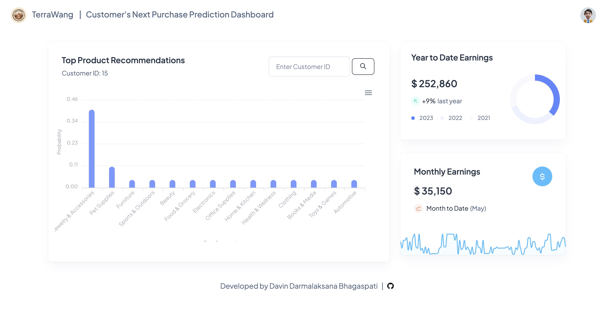
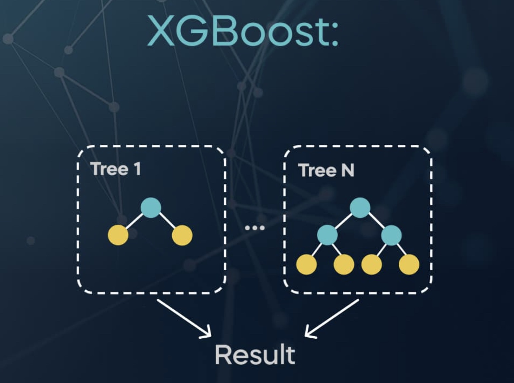
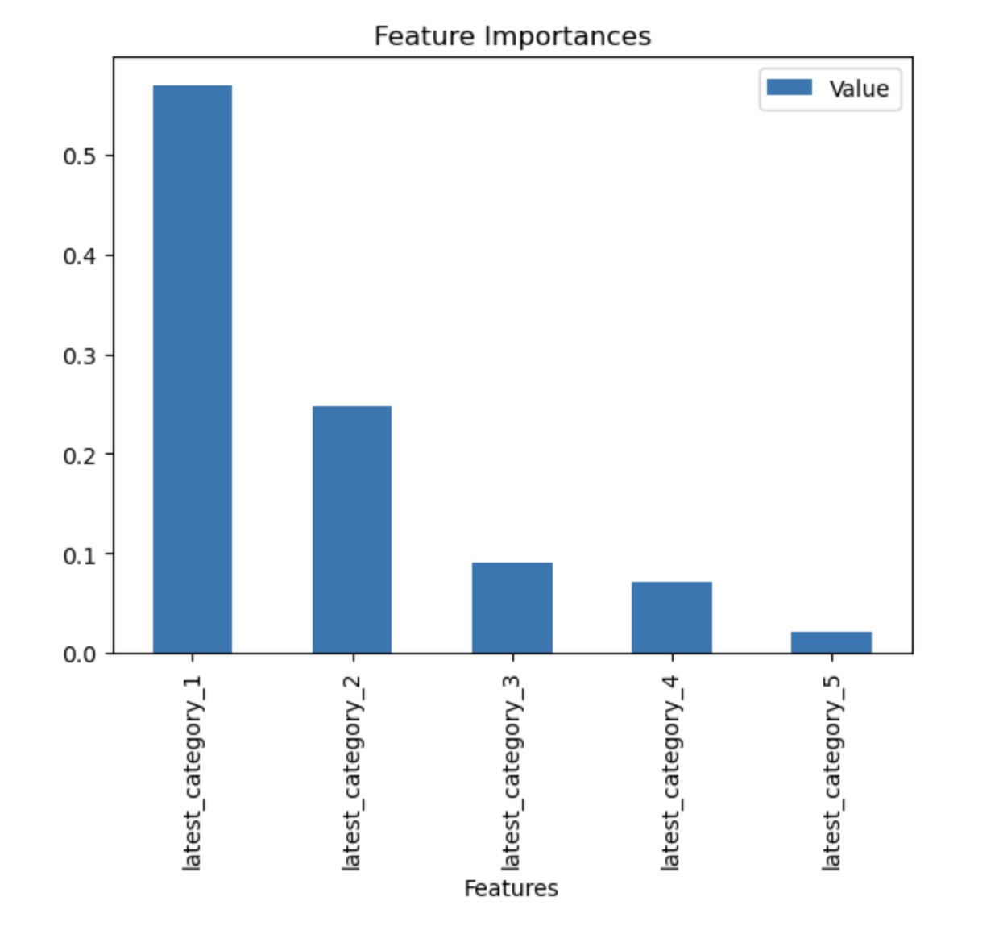
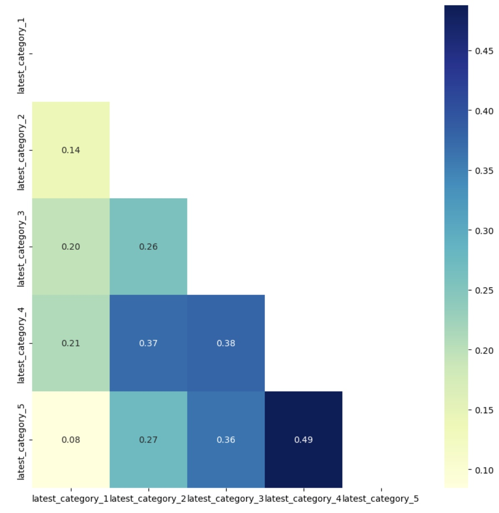

<!--
*** WELCOME TO TERRAWANG PROJECT
*** Thanks for checking out the TerraWang Project Readme. If you have a suggestion
*** that would make this better, please fork the repo and create a pull request
*** or simply open an issue with the tag "enhancement".
*** Thanks again! Now go create something AMAZING! :D
-->

<!-- COLOR CODE: 082c4e -->

<!-- PROJECT LOGO -->
 

  

  <h2 align="center">TerraWang | Marketing Strategy Dashboard</h2>
  <h3 align="center">AI-Powered Application to Predict Customer's Next Purchase</h3>

  

    Welcome to TerraWang, the cutting-edge AI-powered application designed to enhance Terra Store marketing strategy by predicting customer purchase behavior based on historical data.
     
      
    <a href="https://github.com/davindb/terrawang-app/#about-the-project"><strong>Let's Get Started »</strong></a>
     
     
    <a href="https://github.com/davindb/terrawang-app/#readme">App Overview</a>
    ·
    <a href="https://terra-store-web.netlify.app/">Our Website</a>
    ·
    <a href="https://github.com/davindb/terrawang-app/#contributing">Contribute</a>
    ·
    <a href="https://github.com/davindb/terrawang-app/issues">Report Bug</a>
    
  

<!-- TABLE OF CONTENTS -->

  
<h2 style="display: inline-block">Table of Contents</h2>

  <ol>
    <li><a href="#about-the-project">About The Project</a></li>
    <li><a href="#resources">Resources</a></li>
    <li><a href="#getting-started">Getting Started</a>
      <ul>
        <li><a href="#prerequisites">Prerequisites</a></li>
        <li><a href="#website-url">Website URL</a></li>
        <li><a href="#web-overview">Web Overview</a></li>
        <li><a href="#app-features">App Features</a></li>
        <li><a href="#machine-learning-model">Machine Learning Model</a></li>
        <li><a href="#web-development">Web Development</a></li>
      </ul>
    <li><a href="#contributing">Contributing</a></li>
    <li><a href="#acknowledgements">Acknowledgements</a></li>
    <li><a href="#copyright">Copyright</a></li>
  </ol>

<!-- ABOUT THE PROJECT -->

## About The Project

In the era of digital transformation and artificial intelligence, the landscape of consumer behavior has undergone a profound shift, with a significant migration from traditional offline shopping to the convenience of online platforms. Today, consumers are empowered with the ability to search for and purchase products based on their specific desires and needs. However, this evolution presents a unique challenge for marketing strategies: <u><em>how can businesses effectively engage customers in a way that not only meets their current needs but also anticipates and fulfills their future desires?</em></u>

To tackle this challenge, we've developed an **AI-powered web application**. This innovative tool uses advanced algorithms to predict a customer's next purchase based on their past behavior and transaction history. This application is a game-changer for marketing strategy teams, providing quick analyses of customer preferences and empowering them to make data-driven decisions on the right products to offer, with higher accuracy than ever before.

For customers, this means receiving targeted ads and offers that align with their expectations. The personalized approach not only enhances their shopping experience but also increases the likelihood of them finding products they genuinely desire. And for businesses, the result is a win-win – satisfied customers and increased profits. The AI-powered web application ensures that companies can efficiently tailor their offerings to meet customer needs, ultimately boosting the chances of substantial financial gains.

<!-- RESOURCES -->

## Resources

- [Python](https://www.python.org/)
- [Node.js](https://nodejs.org/en)
- [Anaconda](https://anaconda.org/)
- [Jupyter Notebook](https://jupyter.org/)
- [XGBoost](https://xgboost.readthedocs.io/en/stable/)
- [Bootstrap](https://getbootstrap.com)
- [ApexCharts](https://apexcharts.com/)
- [Vite](https://vitejs.dev/)
- [Netlify](https://app.netlify.com/)

<!-- GETTING STARTED -->

## Getting Started

This provides an overview of TerraWang, including prerequisites, instructions on using the app, and how we built the machine learning model.

### Prerequisites

- Google Chrome (Recommended)
- Internet Connection

### Website URL

- [TerraWang](https://terrawang-app.netlify.app/)

<!-- APPS OVERVIEW -->

### Web Overview

  

<!-- OUR FEATURES -->

### App Features

1. Explore personalized product recommendations for each customer.
2. Visualize probabilities and product categories using a bar chart.
3. Access Year-to-Date earnings data, comparing it to the previous years.
4. Review monthly earnings information for a quick overview.

<!-- MODEL -->

### Machine Learning Model

  

The underlying model powering this application is constructed using **XGBoost**, a powerful machine learning algorithm renowned for its superior performance and versatility. XGBoost, or eXtreme Gradient Boosting, offers several advantages over alternative algorithms. It excels in handling complex relationships within data, providing high accuracy and efficiency. One of its distinctive features is regularization, which helps prevent overfitting, making it robust to noise and outliers. Moreover, XGBoost employs a gradient boosting framework, enabling it to handle missing data effectively.

  
  

The model is trained on a set of five carefully selected features, each representing the latest purchased category. These features capture the nuanced patterns in user behavior and contribute significantly to the predictive power of the model. Feature selection is a crucial step in model development, and in this case, two techniques are employed: feature importance and correlation analysis.

The feature importance technique assesses the contribution of each feature to the model's predictive capability. It assigns scores to features based on their impact, allowing us to prioritize those with the most significant influence on the outcome. On the other hand, correlation analysis explores the relationships between different features, helping identify redundant or highly correlated variables. By leveraging both techniques, we ensure a streamlined and efficient set of features, enhancing the model's interpretability and generalization to new data. These rigorous feature selection processes contribute to the model's accuracy and reliability, making it a robust tool for understanding and predicting user preferences based on their latest category purchases.

For a comprehensive understanding of the dataset construction process, kindly consult the associated `notebook` for detailed information.

<!-- WEB -->

### Web Development

  
  &nbsp;&nbsp;&nbsp;&nbsp;&nbsp;
  

The construction of the website was facilitated by leveraging JavaScript plugins within the Vite framework. The dynamic charts, powered by ApexCharts, enhance the visual representation of data, making it dynamic and efficient. I customized the HTML using JavaScript for better user interactions. The web services, built with Node.js, include two key APIs: predict_proba for predictions and customer transactions for transaction data. For an in-depth exploration of the code architecture and construction details, I recommend referring to the `api.js` file, where a comprehensive breakdown awaits.

<!-- CONTRIBUTING -->

## Contributing

Contributions are what make the open source community such an amazing place to be learn, inspire, and create. Any contributions you make are **greatly appreciated**.

1. Fork the Project
2. Create your Feature Branch (`git checkout -b feature/AmazingFeature`)
3. Commit your Changes (`git commit -m 'Add some AmazingFeature'`)
4. Push to the Branch (`git push origin feature/AmazingFeature`)
5. Open a Pull Request

<!-- ACKNOWLEDGEMENTS -->

## Acknowledgements

I extend my sincere gratitude to [**Skilvul**](https://skilvul.com/) for providing me with the opportunity to undertake this technical assignment. The project is not only a valuable learning experience but also a platform through which I can enhance my knowledge and skills in AI & Data Science. I appreciate the support and guidance and this achievement is proudly presented for Skilvul.

  

<!-- COPYRIGHT -->

## Copyright

Davin Darmalaksana Bhagaspati © Copyright 2024 | All Rights Reserved.

<!-- MARKDOWN LINKS & IMAGES -->
<!-- https://www.markdownguide.org/basic-syntax/#reference-style-links -->
